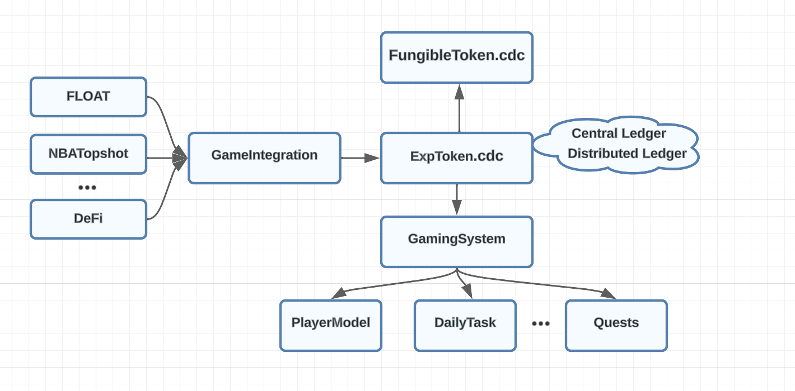

### Gamifying On-Chain Behavior on Flow
September 2023 Cadence Competition

Contract deployment can be viewed at:

https://flow-view-source.com/mainnet/account/0xab0f1e1c08b6116d

#### Meeting Cadence

I am honored to participate in such a compact competition, allowing me to acquire new knowledge. I was fortunate enough to learn about Cadence and Flow through Emerald City. Given the tight timeline and as a beginner in Cadence, I decided to fulfill a long-standing desire: to gamify the entire blockchain, where every user becomes a player and all on-chain behaviors grant additional experience points. With Flow’s impressive concurrency capabilities and remarkably low fees, this all became possible. In this competition, my primary focus was to familiarize myself with Cadence’s features. Gamification is a vast project. Currently, I’ve only provided basic modules like player level, attribute growth, and daily tasks. There’s a long way ahead.

#### Undeterred by Challenges

To be honest, Cadence, compared to other smart contract languages, isn’t the easiest to pick up. However, this isn’t due to any lack of sophistication. In fact, once you get acquainted with Cadence, its elegance becomes apparent. Many Solidity developers are deterred, perhaps because of Cadence’s uniqueness. Its principles vary significantly from Solidity, which initially led to my discomfort. For instance, a basic feature in Solidity like msg.sender goes against Cadence’s design philosophy, and this brings conflicts like the centralized ledger versus the distributed ledger design pattern. All these differences demanded fundamental adjustments on my part.

#### The Distinctiveness of Cadence

Upon delving deeper into Cadence, what appealed to me most was its security. In traditional Solidity development, a significant effort is invested in ensuring code safety and identifying vulnerabilities. To be frank, it’s quite disheartening, and often, contracts audited by multiple firms still end up having discovered flaws. Issues like re-entrancy, permissions, and other nuances have always frustrated developers. However, with Cadence, thanks to the uniqueness and ownership of Resources, contracts inherently resist many vulnerabilities. Each Resource feels like a tangible asset, ensuring its safe existence regardless of the logic applied. It’s truly reassuring.

#### The Gamification Framework

For this competition, I’ve submitted a basic gamification framework. This framework revolves around experience points. I’ve materialized experience points as a Fungible Token (FT). This not only benefits from the security offered by Resources but also facilitates easy transfers and trades. However, I’ve made an upgrade to this ExpToken.cdc. While Cadence’s FT follows a distributed ledger model, there are scenarios where a centralized ledger has its advantages. For instance, if a player hasn’t set up their local Exp token Vault, any earned Exp through certain actions is stored in a centralized ledger for future retrieval. In ExpToken.cdc, I’ve designed a model combining both centralized and distributed ledgers. For the gamification of on-chain behaviors, I employed an API Wrapper approach, ensuring controlled asset minting, free from misuse. But there are downsides: it might introduce centralization risks, and a strong marketing push would be needed for project parties to adapt their interfaces. Off-chain validation could bypass this, but it wasn’t considered due to the competition’s contract-centric nature. Admittedly, this is just a prototype, and there’s much more to be accomplished in the future.
